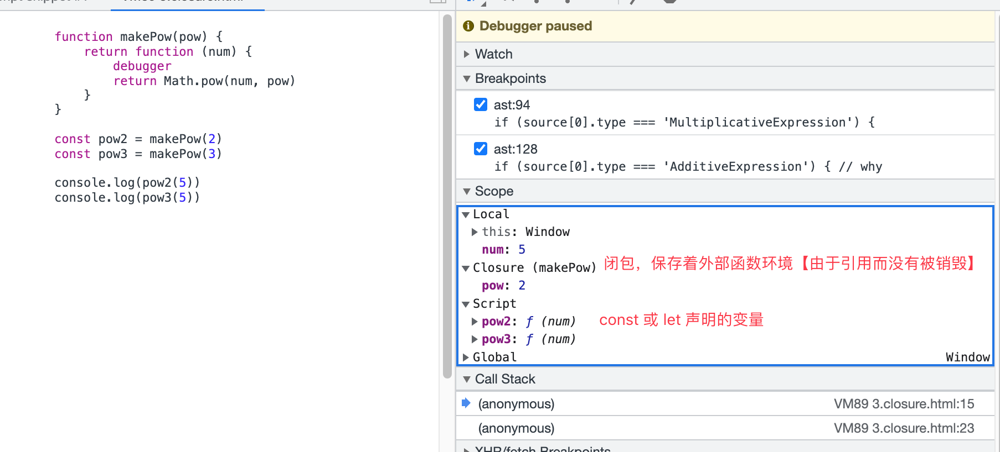

# 函数式编程

## Why

- React
- vue3 开始拥抱函数式编程
- 函数式编程可以抛弃 this ?
- 打包过程中更好的 tree sharking 过滤无用代码
- 方便测试，方便并行处理
- 有很多库可以帮助我们进行函数式开发：lodash、underscore、ramda

## What

函数式编程(Function Programming, FP), 是一种编程范式。

- 函数式编程的思维方式：对运算过程进行抽象(事物之间的关系)，然后去重用这些函数。
  - 程序的本质是运算。
  - 函数式编程中的函数不是程序中的函数，而是数学中的函数即映射关系，如 y = sin(x)。
  - 相同的输入始终要得到相同的输出(纯函数)。
- 面向对象编程的思维方式：把现实中事物抽象为类或对象。

## How

学习函数式编程的一些概念。

### JS 中的函数

- 函数是一等公民(First-class Function), 即函数存储为变量，并且可以作为参数和返回值。
- 高阶函数（Higher-order function）
  - 函数作为参数或返回值
  - 高阶函数的意义：不用关心具体过程，只需要关心实现目标

```js
// 面向过程的方式，需要关注遍历运算的过程
let arr = [1, 2, 3];
for (let item of arr) {
  console.log(item);
}

// 函数式编程，将运算进行抽象，不需要关注遍历，只需要关注处理函数
forEach(arr, () => {
  console.log(item); // 只有这里需要关注
});
```

### 数组中常用高阶函数

- forEach
- map
- filter
- some
- every
- find/findIndex
- reduce
- sort
- ...

### 闭包

闭包(Closure): 函数和其周围的状态(词法环境)的引用捆绑在一起，形成闭包。

闭包的本质：函数执行完成后，堆上的作用域成员因为被外部引用不能被释放，所以函数内部依然可以访问外部函数的成员。



### 纯函数

纯函数：相同的输入永远得到相同的输出。而且没有任何可观察的副作用。

纯函数就是类似数学中的函数，y = f(x)。

数组的 slice 和 splice 分别是纯函数和不纯的函数。

- slice 不会改变原数组
- splice 会对数组进行操作，改变原数组。

- 函数式编程不会保留计算中间的结果，所以变量是不可变的(无状态的)
- 我们可以把一个函数的执行结果交给另一个函数去处理

好处：

- 可缓存，因为对相同的输入有相同的输出，所以可以将比较耗时的重复操作进行缓存
- 可测试，纯函数始终有输入和输出，断言是测试结果
- 并行处理
  - 在多线程环境下并行操作共享的内存数据很可能出现意外情况
  - 纯函数不需要访问共享的内存数据，所以在并行环境下可以任意运行纯函数(Web Worker)

## lodash

## 副作用

```js
// 不纯的
let mini = 18;
function checkAge(age) {
  return age >= mini;
}

// 纯的
function checkAge(age, mini = 18) {
  return age >= mini;
}
```

副作用让一个函数变的不纯。

副作用的来源：

- 配置文件
- 数据库
- 获取用户的输入

所有的外部交互都可能产生副作用，副作用也使得函数通用性下降，不适合扩展和重用。但是副作用不可能完全禁用，因为比如不可能将用户账号密码不放数据库，放代码里，我们要将副作用控制在可控范围内。

## 柯里化(Haskell Brooks Curry)

可以将多元函数转成一元函数。

- 当一个函数有多个参数的时候，先传递一部分参数调用它(这部分参数以后永远不变)
- 然后返回一个新的函数接受剩余参数，返回结果

```js
// 普通的纯函数
function checkAge(age, mini = 18) {
  return age >= mini;
}
checkAge(20, 18);
checkAge(22, 18);
checkAge(12, 18);

// curry
function checkAge(min) {
  return function (age) {
    return age >= min;
  };
}
const checkAge18 = checkAge(18);
const checkAge20 = checkAge(20);
```

- curry 可以让我们给一个函数传递较少的参数，得到一个新函数。
- 这是一种对参数的缓存
- 可以把多元函数转成一元函数

## lodash 里的 curry

## 函数的组合

- 纯函数和 curry 很容易写出洋葱代码 `h(g(f(x)))`
  - 如 `_.toUpper(_.first(_.reverse(arr)))`
- 函数组合可以把细粒度的函数生成一个新函数，避免洋葱代码

函数组合把多个函数组合在一起，从右向左执行，它像管道一样，上一个函数的返回值会当作下一个函数的输入，

```js
fn = compose(f1, f2, f3);
b = fn(a);
```

lodash 里的组合

- flow(): 从左到右执行
- flowRight(): 从右到左执行

函数的结合律

```
compose(h, g, f)
== compose(compose(h, g), f)
== compose(h, compose(g, f))
```

如何调试组合函数

lodash/fp

- fp 模块提供了实用的对函数式编程友好的方法
- 提供了不可变 auto-curried iteratee-first data-last 的方法

## PointFree

我们可以把数据处理的过程定义成与数据无关的合成运算，不需要用到代表数据的那个参数，只要把简单的运算步骤合并到一起，在使用这种模式之前我们需要定义一些辅助的基本运算函数。

- 不需要指明处理的数据
- 只需要合成运算过程
- 需要定义一些辅助的基本运算函数

## 函子 Functor

- 容器: 包含值和值的变形关系(这个变形关系就是函数)
- 函子：它是一个特殊的容器，通过一个普通对象来实现，该对象具有 map 方法

函子用来将副作用控制在可控范围内，可以用来处理异常、异步操作等。

步骤

- 函数式编程的运算不直接操作值，而是由函子完成
- 函子就是一个实现了 map 方法的对象，map 方法返回一个包含新值的函子
- 函子里封装了一个值，要处理值，就要给 map 传递一个处理值的纯函数

### Either 函子

- Either 两者中的任何一个，类似 if else 的处理
- Either 函子可以用来异常处理

### IO 函子

- IO 函子的 \_value 是一个函数，这里是把函数作为值来处理
- IO 函子可以把不纯的动作存储到 \_value 中，延迟执行这个不纯的操作(惰性执行)，包装当前的操作
- 把不纯的操作交给调用者来处理

Task 异步执行

- 异步任务的实现过于复杂
- falktale

Pointed 函子

- 实现了静态 of 方法的函子
- of 方法是为了避免 new 来创建对象，更深层的含义是 of 方法用来把值放在上下文 Context(容器) 中，使用 map 来处理。

Monad(单子)

- 可以变扁的 Pointed 函子, IO(IO(x))
- 具有 join 和 of 两个方法，并遵守一些定律

## 附录

https://www.ruanyifeng.com/blog/2017/02/fp-tutorial.html
