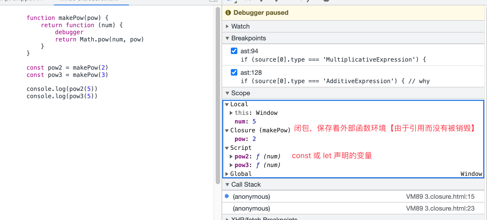

# 函数式编程

## 为什么学习函数式编程

- React
- vue3 开始拥抱函数式编程
- 函数式编程可以抛弃 this ?
- 打包过程中更好的 tree sharking 过滤无用代码
- 方便测试，方便并行处理
- 有很多库可以帮助我们进行函数式开发：lodash、underscore、ramda

## 什么是函数式编程

函数式编程(Function Programming, FP), 是一种编程范式。

- 函数式编程的思维方式：对运算过程进行抽象(事物之间的关系)，然后去重用这些函数。
  - 程序的本质是运算。
  - 函数式编程中的函数不是程序中的函数，而是数学中的函数即映射关系，如 y = sin(x)。
  - 相同的输入始终要得到相同的输出(纯函数)。
- 面向对象编程的思维方式：把现实中事物抽象为类或对象。

### JS 中的函数

- 函数是一等公民(First-class Function), 即函数存储为变量，并且可以作为参数和返回值。
- 高阶函数（Higher-order function）
  - 函数作为参数或返回值
	- 高阶函数的意义：不用关心具体过程，只需要关心实现目标

```js
// 面向过程的方式，需要关注遍历运算的过程
let arr = [1, 2, 3];
for (let item of arr) {
  console.log(item);
}

// 函数式编程，将运算进行抽象，不需要关注遍历，只需要关注处理函数
forEach(arr, () => {
  console.log(item); // 只有这里需要关注
});
```

### 数组中常用高阶函数

- forEach
- map
- filter
- some
- every
- find/findIndex
- reduce
- sort
- ...

## 闭包

闭包(Closure): 函数和其周围的状态(词法环境)的引用捆绑在一起，形成闭包。

闭包的本质：函数执行完成后，堆上的作用域成员因为被外部引用不能被释放，所以函数内部依然可以访问外部函数的成员。


