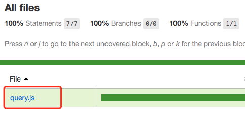
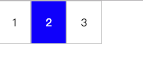

# jest 测试框架

## 特点

- 速度快
- API 简单
- 易配置
- 隔离性好
- 监控模式
- IDE 整合
- Snapshot
- 多项目并行
- 覆盖率
- Mock 丰富

```
npm jest --init // 初始化 jest.config.js 配置文件
```

## 入门

将`package.json`里的`script test`，改成`jest`。

```javascript
// 测试用例 testCase
test("url parse", () => {
  expect(url.parse("?a=1", "a")).toBe("1"); // 断言
  expect(url.parse("?a=1&b=2", "b")).toBe("2");
});

test("format date", () => {
  expect(formatDate("20110101")).toBe("2011-01-01");
});

// test group
describe("test date", () => {
  // test case
  test("format date", () => {
    // assert
    expect(formatDate("20110101")).toBe("2011-01-01");
  });

  // test case
  test("format date to timestamp", () => {
    expect(formatDate("20110101")).toBe("1312321321");
  });
});
```

- test suits 测试套件，每个文件
- test group
- test case
- test asset

## 配置

可以在`package.json`、`jest.config.js`或者命令行配置。

```javascript
// jest.config.js
module.exports = {
    // testMatch和testRegex互斥，只用一个
    testMatch: ['**/test/**/*.js?(x)', '**/?(*.)(spec|test).js?(x)'], // ['<rootDir>/test/**/*.js']
    testRegex:'',
    testEnvironment:'jsdom', // node
    rootDir:'', // 默认是package.json所在目录，没有则pwd
    moduleFileExtensions: ['js', 'json', 'jsx', 'node]
}

// package.json
{
    "jest":{}
}

// 命令行
jest --watch
```

## 命令行

```
 › Press a to run all tests.  运行所有测试用例
 › Press f to run only failed tests. 运行失败的测试用例
  // 运行修改文件的测试用例，需要 git 记录文件差异，否则报错
 › Press o to run all test suites related to changed files
 › Press p to filter by a filename regex pattern. 通过文件名过滤文件
 // 通过测试名称过滤文件，即 test('xx', ()=>{}) 的描述 xx
 › Press u to update failing snapshots. 更新快照
 › Press i to update failing snapshots interactively. 交互式更新快照（多个快照时可以一个个更新）
 › Press t to filter by a test name regex pattern.
 › Press q to quit watch mode.  // 退出 watch
 › Press Enter to trigger a test run.
```

## 常用的 Matchers

因为有些东西不好比较，比如`{a:1}`和`{a:1}`是否值相等。所以出现了匹配器 matchers。

- `toBe()`: 全等，是通过 Object.is() 实现的。
- `toEqual()`：值相等，可以用于判断对象，如 {a:1} 和 {a:1} 是相等的。
- `not`：将 Matchers 取反，如 not.toBe()
- `toBeNull()`：只能是 null
- `toBeUndefined()`：只能是 undefined
- `toBeDefined()`：非 undefined
- `toBeTruthy()`：匹配为 true 的表达式
- `toBeFalsy()`：匹配为 false 的表达式
- `toBeGreaterThan()`：数字大于
- `toBeGreaterThanOrEqual()`：数字大于或等于
- `toBeLessThan()`：小于
- `toBeLessThanOrEqual()`：小于或等于
- `toBeCloseTo()`： 近似，比如 expect(0.1+0.2).toBeCloseTo(0.3)
- `toMatch()`：字符串匹配，如 `expect('Christoph').toMatch(/stop/)`
- `toContain()`：数组包含某个值
- `toThrow()`：匹配抛出的错误，可以是正则或字符串
- `toHaveProperty()`查看某个对象有某个属性

```javascript
// 例子1
function compileAndroidCode() {
  throw new ConfigError("you are using the wrong JDK");
}

test("compiling android goes as expected", () => {
  expect(compileAndroidCode).toThrow();
  expect(compileAndroidCode).toThrow(ConfigError);

  // You can also use the exact error message or a regexp
  expect(compileAndroidCode).toThrow("you are using the wrong JDK");
  expect(compileAndroidCode).toThrow(/JDK/);
});

// 例子2
let person = {
  name: "张三",
  age: 12,
  parent: {
    name: "张二",
    age: 50,
  },
};

describe("test person", () => {
  test("person has property", () => {
    expect(person).toHaveProperty("parent");
    expect(null).toBeNull();
    expect("123").toMatch(/\d+/);
    expect("123").not.toMatch(/\d+/);
  });
});

// 例子3
const removeItemByIndex = (i, arr) => {
  arr.splice(i, 1);
  return arr;
};

describe("remoteItemByIndex", () => {
  test("remove item by index", () => {
    expect(removeItemByIndex(1, [1, 2, 3])).toEqual([1, 3]);
    expect(removeItemByIndex(0, [1, 2, 3])).toEqual([2, 3]);
  });
});
```

## 测试异步流程

异步流程需要在完成后调用`done()`方法，否则`jest`会报超时错误。下面是一个简单的例子。

```javascript
function ajax(success) {
  setTimeout(() => {
    const data = { name: 3 };
    success(data);
  }, 1000);
}

test("ajax data.name is 3", (done) => {
  const success = (data) => {
    expect(data.name).toBe(3);
    done();
  };
  ajax(success);
});
```

实际中不能访问远程的数据，因为没有`XMLHttpRequest`对象。所以需要使用`mocks`模拟远程数据。

下面是一个测试防抖函数`debounce`的例子。

```javascript
/**
 * 创建 debounce 函数
 * @param {Function} callback
 * @param {Number} time
 */
function createDebounce(callback, time) {
  var timer;
  time = time || 300; // 给个默认值

  return function () {
    if (timer) {
      clearTimeout(timer);
    }

    timer = setTimeout(() => {
      callback();
    }, time);
  };
}
describe("debounce", () => {
  test("debounce", (done) => {
    let a = 1;
    let debounce = createDebounce(() => {
      // 创建一个 debounce
      a = 2;
    }, 1000);
    debounce();
    expect(a).toBe(1);
    setTimeout(() => {
      debounce();
      expect(a).toBe(1);
    }, 500);
    setTimeout(() => {
      expect(a).toBe(1);
    }, 1000);
    setTimeout(() => {
      expect(a).toBe(2);
      done();
    }, 2500);
  });
});
```

> 好的代码，能被测试的代码，都是模块化的。

## mocks

擦除函数的实际实现来测试代码之间的链接，模拟对函数的调用。`jest`里的 mocks 有 2 种：`Mock Function` 和 `Manual mock`。

```javascript
// Mock Function
const forEach = (arr, callback) => {
  for (let i = 0; i < arr.length; i++) {
    callback(arr[i]);
  }
};

test("forEach", () => {
  const mockFn = jest.fn();
  forEach([1, 2, 3], mockFn);

  // 调用多少次
  expect(mockFn.mock.calls.length).toBe(3);

  // 参数，第1次的第1个参数
  expect(mockFn.mock.calls[0][0]).toBe(1);
  expect(mockFn.mock.calls[2][0]).toBe(3);
});

// Manual Mock 模拟模块，需要在同级目录创建 __mocks__ 文件夹。
// jquery.js
module.exports = (selector) => document.querySelector(selector);

// jquery.test.js
jest.mock("jquery");
let $ = require("jquery");

test("jquery", () => {
  document.body.innerHTML = '<div id="box">hello</div>';
  expect($("#box").innerHTML).toBe("hello");
});
```

## 代码覆盖率

代码覆盖率包括：

- line coverage 行覆盖率
- function coverage 函数覆盖率
- branch coverage 分支覆盖率
- statement coverage 语句覆盖率，因为有时候一行写了多条语句，最好把语句按行分开规范化代码

jest 内置了 [istanbul](https://github.com/gotwarlost/istanbul) 生成代码测试覆盖率。

```bash
node_modules/.bind/jest --coverage

// 或者
npx jest --coverage
```

运行上面的命令会在项目根目录生成一个 coverage 的目录。打开 `Icov-report/index.html` 可以查看到测试覆盖率，点击网页上具体的文件，可以看到那些代码没有测试到。



## 怎么使用 es6 的 import 和 export

node 默认是不支持 es6 的模块导入导出的，需要使用 babel 进行转义。具体方法如下：

**1. 安装插件**

```shell
npm i --save-dev @babel/preset-env @babel/core
```

- `babel-jest`：安装 jest 时它会被自动安装，作用是在允许 jest 时将代码通过 babel 转义。
- `@babel/preset-env`：会根据当前环境转换不支持的代码。当前环境是指执行编译后代码的环境，比如浏览器比如 nodejs 等。`@babel/preset-env` 中存储的是 各个浏览器和其它运行环境的核心版本号以及支持 js 的版本标识。然后自动生成一个配置给 babel 来做编译转换。babelrc 里设置`presets`会自动转换那些环境不支持的代码。

**2. 配置 babel**

jest 默认运行环境就是 test。所以在根目录的 .babelrc 文件新增下面代码：

```js
{
    "presets": [
      [
        "@babel/preset-env", {
          "targets": {
            "node": "current"
          }
        }
      ]
    ]
}
```

**3. 使用**

```javascript
// es6模块文件：util.js
const util = {
  query: function (str) {
    return str.replace(/^.+=/, "");
  },
};

export default util;

// 测试文件：__test__/util.js
import util from "../src/query";

test("query a  =  3", () => {
  expect(util.query("a=3")).toBe("3");
});
```

## 介绍

**1. 安装 jest**

```
yarn add --dev jest
npm i jest
```

**2. 运行**

```
# 测试，配置package.json的test， { "test": "jest --watchAll"}
npm run test

# 运行某个目录的测试
npx jest src/ --notify --config=config.json

# 运行单文件测试
npx jest 1.test.js
```

### 配置文件

通过`jest --init`命令初始化创建，会在根目录创建`jest.config.js`。

### 使用 Babel

```
# 安装 babel-jest regenerator-runtime
yarn add --dev babel-jest babel-core regenerator-runtime

# babel 7，需要安装babel-jest, babel-core@^7.0.0-bridge.0, @babel/core
yarn add --dev babel-jest babel-core@^7.0.0-bridge.0 @babel/core regenerator-runtime
```

如果使用`npm 3/4`或`yarn`不需要安装`regenerator-runtime`。

如果使用 es6 和 react.js，需要配置.babelrc 的预设：

```json
{
  "presets": ["env", "react"]
}
```

> 注意：Babel 的 env 配置，jest 会自动定义 NODE_ENV 为`test`，它不会在 Babel 没有设置 NODE_ENV 时使用`development`。

> 注意：如果关闭了 es6 module，`{"modules": false}`，需要在测试环境打开它

```json
{
  "presets": [["env", { "modules": false }], "react"],
  "env": {
    "test": {
      "presets": [["env"], "react"]
    }
  }
}
```

> 提示：如果有 babel 配置，安装 jest 时会自动安装`babel-jest`来自动转换文件。如果不需要可以修改`transform`配置。

```json
// package.json
{
  "jest": {
    "transform": {}
  }
}
```

要用 typescript，可以使用[`ts-jest`](https://github.com/kulshekhar/ts-jest)。

## Matchers

toBe 使用`Object.js`测试确切的相等性。如果要检查对象值相等，用`toEqual`。

```javascript
// Object.is  和  === 的区别
Object.is(0, +0); // true
Object.is(-0, +0); // false
Object.is(-0, 0); // false
Object.is(NaN, NaN); // true

// 测试对象值相等
test("object assignment", () => {
  const data = { one: 1 };
  data["two"] = 2;
  expect(data).toEqual({ one: 1, two: 2 });
});

// 测试反面
expect(3).not.toBe(4);
```

测试中，有时需要区分`undefined`、`null`以及`false`。jest 相关的 matchers 如下：

- `toBeNull`只匹配`null`
- `toBeUndefined`只匹配`undefined`
- `toBeDefined`
- `toBeTruthy`匹配 if 判断为 true 的内容
- `toBeFalsy`匹配 if 判断为 false 的内容

数字的比较:

```javascript
test("two plus two", () => {
  const value = 2 + 2;
  expect(value).toBeGreaterThan(3);
  expect(value).toBeGreaterThanOrEqual(3.5);
  expect(value).toBeLessThan(5);
  expect(value).toBeLessThanOrEqual(4.5);

  // toBe and toEqual are equivalent for numbers
  expect(value).toBe(4);
  expect(value).toEqual(4);
});
```

对于浮点数相等，使用`toBeCloseTo`而不是`toEqual`，因为您不希望测试依赖于微小的舍入误差。。

```
expect(0.1+0.2).toBeCloseTo(0.3)
```

检查字符串可以使用 toMatch:

```
expect('team').not.toMatch(/I/);
expect('Christoph').toMatch(/stop/);
```

数组可以使用`toContain`，不会隐式转换数字和字符串:

```javascript
expect(arr).toContain(1);
```

测试抛出异常：

```
function compileAndroidCode() {
  throw new ConfigError('you are using the wrong JDK');
}

test('compiling android goes as expected', () => {
  expect(compileAndroidCode).toThrow();
  expect(compileAndroidCode).toThrow(ConfigError);

  // You can also use the exact error message or a regexp
  expect(compileAndroidCode).toThrow('you are using the wrong JDK');
  expect(compileAndroidCode).toThrow(/JDK/);
});
```

## 异步代码测试

### 回调函数，使用 done

调用了 done() 才认为测试用例执行完成了。

### promise

直接在 then 或 catch 里测试，注意要使用 return

```javascript
const fetchData1 = () => {
  return new Promise((resolve, reject) => {
    setTimeout(() => {
      resolve(10);
    }, 1000);
  });
};

test("this data is hello", () => {
  return fetchData1().then((data) => {
    expect(data).toBe(10);
  });
});

// 使用.resolves将自动resolve()
return expect(fetchData()).resolves.toBe("peanut butter");
// 使用.resolves将自动reject()
return expect(fetchData()).rejects.toBe("peanut butter");
```

### async/await

很简单，像同步即可。

```js
test("the data is peanut butter", async () => {
  expect.assertions(1);
  const data = await fetchData();
  expect(data).toBe("peanut butter");
});

test("the fetch fails with an error", async () => {
  // 断言,表示必须执行2次expect 代码才算执行完
  expect.assertions(2);
  try {
    await fetchData();
  } catch (e) {
    expect(e).toMatch("error");
    expect(e).toMatch("error");
  }
});

// 也可以使用.resolves、.rejects
test("the data is peanut butter", async () => {
  await expect(fetchData()).resolves.toMatchObject({
    data: {
      success: true,
    },
  });
});

test("the fetch fails with an error", async () => {
  expect.assertions(1);
  await expect(fetchData()).rejects.toThrow();
});
```

## 钩子

```js
// 会在每个测试用例test调用之前或之后执行，可以处理异步，使用done
beforeEach(() => {});
afterEach(() => {});
beforeEach(() => {
  return new Promise();
});

// 在测试之前和之后执行一次
beforeAll();
afterAll();
```

关于作用域问题：

```javascript
// 作用域当前文件的所有test
beforeEach(() => {
  return initializeCityDatabase();
});

test("city database has Vienna", () => {
  expect(isCity("Vienna")).toBeTruthy();
});

test("city database has San Juan", () => {
  expect(isCity("San Juan")).toBeTruthy();
});

describe("matching cities to foods", () => {
  // 作用于当前describe
  beforeEach(() => {
    return initializeFoodDatabase();
  });

  test("Vienna <3 sausage", () => {
    expect(isValidCityFoodPair("Vienna", "Wiener Schnitzel")).toBe(true);
  });

  test("San Juan <3 plantains", () => {
    expect(isValidCityFoodPair("San Juan", "Mofongo")).toBe(true);
  });
});
```

忽略其它的 test。使用`test.only()`进行调试。

## mock

mock 可以用来模拟函数、类和模块，它可以:

- 模拟函数，得到函数的调用信息。比如测试函数是否被调用`toHaveBeenCalled()`
- `.mockReturnValue()`模拟函数的返回值
- `.mockImplementation()` 修改函数实现
- `.mockName()`设置 mock 函数的名字，打印信息时显示

`jest.fn()`可以用来模拟函数的实现，它能获得函数调用的信息：

- calls:一个二维数组，保存着每次调用的参数
- instances: 每次调用的 this 指向
- invocationCallOrder: 函数的调用顺序
- results: 保存着每次调用的返回值

```js
function forEach(items, callback) {
  for (let index = 0; index < items.length; index++) {
    callback(items[index]);
  }
}

const mockCallback = jest.fn((x) => 42 + x);

forEach([0, 1], mockCallback);

console.log(mockCallback.mock);
expect(mockCallback.mock.calls.length).toBe(2);
expect(mockCallback.mock.calls[0][0]).toBe(0);
expect(mockCallback.mock.calls[1][0]).toBe(1);
expect(mockCallback.mock.result[0].value).toBe(42);

// 调用函数的this实例
expect(someMockFunction.mock.instances.length).toBe(2);
```


### mock 返回值

```js
const myMock = jest.fn();
console.log(myMock());
// > undefined

myMock.mockReturnValueOnce(10).mockReturnValueOnce("x").mockReturnValue(true);

console.log(myMock(), myMock(), myMock(), myMock());
// > 10, 'x', true, true

// 例子
const filterTestFn = jest.fn();

// Make the mock return `true` for the first call,
// and `false` for the second call
filterTestFn.mockReturnValueOnce(true).mockReturnValueOnce(false);

const result = [11, 12].filter(filterTestFn);

console.log(result);
// > [11]
console.log(filterTestFn.mock.calls);
// > [ [11], [12] ]
```

## 模拟模块

下面的方法，模拟 axios 模块后，再模拟 get 的返回值。

```javascript
// users.js
import axios from "axios";

class Users {
  static all() {
    return axios.get("/users.json").then((resp) => resp.data);
  }
}

export default Users;

// users.test.js
import axios from "axios";
import Users from "./users";

// 如果是相对路径，会去找 __mocks__ 目录下的
// jest.mock('./user')
// jest.unmock('./user') 取消模拟
// 配置 automock: true 可以自动模拟，会自动去 __mocks__ 目录下找同名的文件模块
// const {getNumber} = jest.requireActual('./user') 从真实模块里引入
jest.mock("axios");

test("should fetch users", () => {
  const resp = { data: [{ name: "Bob" }] };
  axios.get.mockResolvedValue(resp); // 模拟返回值，而不会真发请求

  // or you could use the following depending on your use case:
  // axios.get.mockImplementation(() => Promise.resolve(resp))

  return Users.all().then((users) => expect(users).toEqual(resp.data));
});
```

## Mock Timers

- `jest.useFakeTimer()` 使用假的定时器
- `jest.runAllTimers()` 运行所有定时器
- `jest.runOnlyPendingTimers()` 运行即将运行的定时器
- `jest.advanceTimersByTime()` 提前多少毫秒执行定时器

```js
const timer = function (callback) {
  setTimeout(() => {
    callback();
    setTimeout(() => {
      callback();
    }, 2000);
  }, 3000);
};

jest.useFakeTimers(); // 用假的定时器
test("timer call", () => {
  const fn = jest.fn();
  timer(fn);
  // jest.runAllTimers()
  // expect(fn.mock.calls.length).toBe(2)

  // jest.runOnlyPendingTimers() // 只有外层定时器会运行
  // expect(fn.mock.calls.length).toBe(1)

  jest.advanceTimersByTime(3000); // 定时器事件提前3s
  expect(fn).toHavaBeenCalledTimes(1);
  jest.advanceTimersByTime(2000); // 定时器事件提前2s
  expect(fn).toHaveBeenCalledTimes(2);
});
```

取消测试用例之间定时器的相互影响。

```js
beforeEach(() => {
  jest.useFakeTimers();
});
```

## Mock Class

`jest.mock('./util')`如果发现是一个 class，会将 util 及其方法都变成 `jest.fn()`。

**util.js**

```js
export class Util {
  a() {//...复杂}
  b() {//...复杂}
}
```

**demoFn.js**

```js
import { Util } from "./util";
export function demoFn() {
  let util = new Util();
  util.a();
  util.b();
}
```

**demoFn.test.js**

```js
jest.mock("../../src/util.js");
import { Util } from "../../src/util";
import { demoFn } from "../../src/main";

test("测试 demoFn 是否调用了 util.a", () => {
  demoFn();
  expect(Util).toHaveBeenCalled();
  expect(Util.mock.instances[0].a).toHaveBeenCalled();
});
```

## 快照测试

适合配置、UI 的测试。可以用来检查是否和上次的配置、UI 相同。

## 测试 DOM

jest 之所以能够测试 dom，是因为内置了`jsdom`(配置里有个`testEnvironment:'jsdom'`)。这是一个 npm 包，它主要是给`nodejs`使用。除了`jsdom`，还有其它一些解决方案，如：`phantomjs`、`chrome headless`。vuejs 的测试方案是 `jasmine+karma`，karma 会捕获本机器上的浏览器并自动运行测试代码。

```js
// 例子1: 测试移除dom元素
Pencil.removeNode = (node) => {
  return node.parentNode.removeChild(node);
};
test("remove node", () => {
  document.body.innerHTML = '<div id="p"><p id="c">hello</p></div>';
  const p = document.querySelector("#p");
  expect(p.nodeName.toLowerCase()).toBe("div");
  const c = document.querySelector("#c");
  Pencil.removeNode(c);
  expect(document.querySelector("#c")).toBeNull();
});

// 例子2: 测试点击事件
Pencil.on = (node, type, handler) => {
  node.addEventListener(type, handler, false);
};
test("on event", () => {
  document.body.innerHTML = '<div id="p"><p id="c">hello</p></div>';
  const p = document.querySelector("#p");
  Pencil.on(btn, "click", () => {
    p.innerHTML = "clicked";
  });
  p.click();
  expect(p.innerHTML).toBe("clicked");
});
```

## 测试 UI 组件

下面展示一个测试 UI 组件的例子，点击按钮时变色，其它按钮恢复原状。



```javascript
// html 结构
<ul>
  <li></li>
  <li></li>
  <li></li>
</ul>;

// radio.js 功能文件
function initRadio() {
  const lis = document.querySelectorAll("li");
  let prev = null;
  let cur = 0;

  lis.forEach((li, i) => {
    li.setAttribute("data-index", i);
    li.addEventListener("click", function () {
      prev = cur;
      cur = this.getAttribute("data-index");
      lis[prev].classList.remove("active");
      lis[cur].classList.add("active");
    });
  });
}

module.exports = initRadio;

// radio.test.js 测试文件
const fs = require("fs");
const initRadio = require("../js/radio");

describe("test radio", () => {
  test("radio init", () => {
    document.body.innerHTML = fs.readFileSync("./index.html");
    initRadio();

    const lis = document.querySelectorAll("li");
    lis[0].click();
    expect(lis[0].classList.contains("active")).toBe(true);
    expect(lis[1].classList.contains("active")).toBe(false);
    expect(lis[2].classList.contains("active")).toBe(false);

    lis[1].click();
    expect(lis[0].classList.contains("active")).toBe(false);
    expect(lis[1].classList.contains("active")).toBe(true);
    expect(lis[2].classList.contains("active")).toBe(false);
  });
});
```
